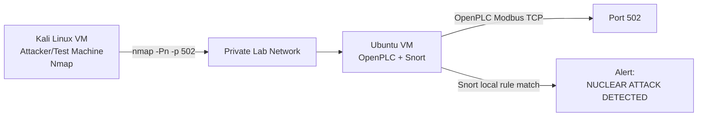

# Lab Architecture

## High-Level Design

The lab uses two virtual machines in a private network:

| Machine | Role | Main Tools | Example IP |
| --- | --- | --- | --- |
| Kali Linux | Attacker/test machine | Nmap | `192.168.10.10` |
| Ubuntu Linux | Target and defender | OpenPLC, Snort | `192.168.10.20` |

## Traffic Flow

1. OpenPLC runs on Ubuntu and listens on Modbus TCP port `502`.
2. Snort monitors the Ubuntu network interface, such as `enp0s8`.
3. Kali sends a scan to Ubuntu port `502`.
4. Snort matches the traffic against the custom local rule.
5. Snort prints the alert message.

## Mermaid Diagram

The diagram source is stored in `assets/diagrams/network-topology.mmd`.

## Why This Architecture Is Useful

This design is simple enough for an academic demonstration but still shows an important security concept: defenders must monitor industrial control traffic and detect suspicious activity before it becomes a bigger incident.

## Important Notes

- The lab should be isolated from public networks.
- Use a host-only or internal VirtualBox network.
- Do not scan real networks.
- Replace all example IP addresses with your own VM IP addresses.
